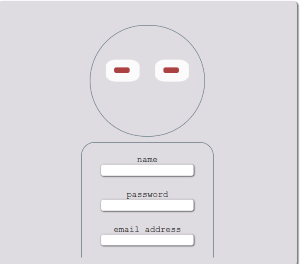
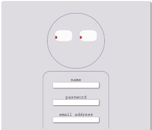
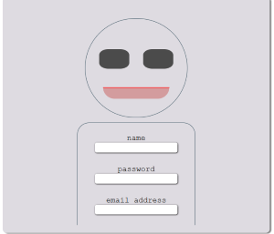

🧠 Human Form UI – Interactive Eyes & Smile
A whimsical HTML/CSS/JS form that reacts to your presence! As your cursor approaches, the eyes follow you. Enter the form, and the eyes blink shut while a hidden smile appears—like magic.

✨ Features
- 👀 Eyes track your mouse movement
- 😴 Eyes blink and close when form is entered
- 😊 Smile appears smoothly without layout shift
- 🧍‍♂️ Human-shaped form layout using pure HTML/CSS
- ⚡️ No libraries, just vanilla JavaScript
## 📸 Screenshots

### 🧍 Idle State
- The form is visible.
- Eyes are open and looking straight ahead.
- Smile is hidden.
- 

### 👀 Eyes Tracking
- Eyes follow the user's mouse movement.
- Smile remains hidden.
- 

### 😊 Smile Revealed
- Eyes blink and close when the form is entered.
- Smile appears smoothly.
- 

🚀 Live Demo
Check out the interactive experience here:
👉 Live Demo on Vercel

🛠️ Tech Stack
- HTML5
- CSS3 (Flexbox, transitions)
- Vanilla JavaScript (DOM manipulation, mouse tracking)

🧪 How It Works
- Eye Movement: Uses mousemove to calculate pointer position and rotate pupils.
- Blink & Smile: On mouseenter event, triggers CSS transitions to close eyes and reveal smile.
- Blink & Smile: On mouseleave event, triggers CSS transitions to open eyes and hide smile.
- Layout Stability: Smile is hidden via opacity and transform, not removed from DOM—preserving layout integrity.
📦 Setup
Clone the repo and open index.html in your browser:
git clone https://github.com/your-username/FUN-FORM.git
cd FUN-FORM

